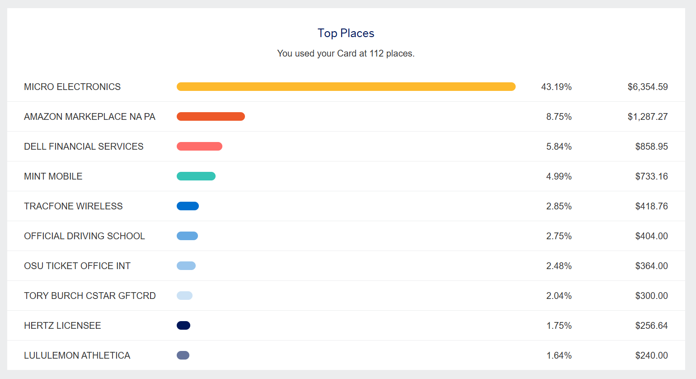

# 标题： PHD玩卡小记

继 俄亥俄-美卡小记-F1学生篇 之后的正文。  致谢 [【新手必读】美国信用卡新手入门攻略【2023年更新】](https://www.uscreditcardguide.com/a-guide-for-beginners/)

进度：

* [ ] Chase
  * [ ] Chase Freedom Flex (CFF)
  * [ ] Chase Freedom Unlimited (CFU)
  * [ ] Chase Sapphire Preferred (CSP)
  * [ ] Chase Sapphire Reserve (CSR) (how dare you)
  * [ ] Chase UA Explorer
  * [ ] Chase UA Quest
  * [ ] Chase World of Hyatt
  * [ ] Chase Marriott Bonvoy Boundless
  * [ ] Chase IHG Premier
* [ ] Amex
  * [ ] Platinum
  * [ ] Gold
  * [ ] Green
  * [ ] EveryDay
  * [ ] Amazon prime (later)
  * [X] Hilton (副卡，第一张)
* [ ] BoA
  * [ ] [BoA Customized Cash Rewards](https://www.uscreditcardguide.com/bankamericard-cash-rewards-boa-123/)
* [ ] Sofi
* [ ] Fedality
* [ ] Wells Fargo
* [ ] Captial One (dead)
* [ ] Discover

之前因为是master自费上学并没有拿到SSN，于是拿走三张普通checking之后便完结了。 这学期成功转博，学校发工资了，也顺利~~（并不太顺利）~~拿到了SSN，也就是身份卡，可以开更多卡片了。

> Cite: 因为walkin的态度都不太好，于是找到了隔壁市次日的名额，去办理了顺便看了空军博物馆。 两周后还是没有收到卡，打电话说让我等一个月再去问。 于是傻傻等了一个月，去了附近的线下办公室，walk-in体验还不错。 工作人员说不是从他们这里申请的他们看不到，但是大概率是被移民局卡了。 于是他们又打电话联系当时办理的那边，果然是移民局卡了，然后当场操作一番之后顺利过关。 也是在7天后顺利拿到了卡片，还有我的车牌。

## 背景

虽然说没有SSN，但是信用记录这块也不能空着。通过朋友办理了Amex的副卡，当时还可以人工客服用护照。  看了下大概是2025.11办的卡，然后当年消费了一共1260.51, 今年刷了14709.15。 ~~当然很多只是交易，比如买礼品卡，买电脑x，并不是自己真的花了这么多x~~

> 买了MC一台U9 64+4T 5090整机，Amazon一些返现的商品，Dell一台Latitude i9 64+256 3080Ti. 两台Mint pixel10+一年套餐。 Tracfone两台iphone16e，驾校400，橄榄球票360， 然后就是礼品卡和租车旅游了。 商品就给朋友或者变成gc了。

Amex已经批了8k+的额度了。 不知道上信用局之后效果会怎么样。

## 还没上信报

那拿到之后已经给了Amex，他们要电话口头念SSN感觉不是很妙x 然后就需要等一两个月去上信用局并且等更新分数了。 要申什么卡片也都大概想好了，可以看文章开头的进度。

那目前先把一些有用的卡先申请下，debit为主。 顺便因为之前chase还没满2yr所以要等后面再去做checking了。 CSP随缘了，主要看能不能等到史高。

## Debit卡

所以为了目录方便，这里单独开一条。

### Paypal

美国最大的支付公司。之前按照外国人身份上传之后超过600的收入也免税了，不知道现在上传SSN之后会怎么样。

•  **自选类别 5% 返现** （每月可选：Groceries买菜、餐饮、加油、服装等），**每月消费上限 $1,000，最高返 $50/月**

这个的优点就是5%，比如walmart等。

### Venmo

同上。但是只有账户没啥活动

• **Venmo Stash** 机制选定 Walmart 或 Target 可享最高 **5% 返现**

### OnePay

• 配合 Walmart+ 会员在沃尔玛消费可享  **3% 返现** （年上限按会员政策）

这张卡的好处是可以从Walmart充值，~~然后可以把VISA/Master卡冲进去。~~

### Chase Checking

这里放一个Chase checking。因为2025.8我开了Chase。导致我如果现在开信用卡前先开Checking放钱会导致拿不到奖励，但是这个要等2027.8才可以再次拿到奖励。

## Credit 卡

碎碎念： 想冲CSP，预期1000-1250开卡收益。 但是查了资料比较麻烦。原因见上面的Chase Checking。 如果没有Chase checking户，仅凭副卡申请Chase信用卡有点悬。 但是5/24最好还是通过Chase起家。

先写到这里后面更新。
